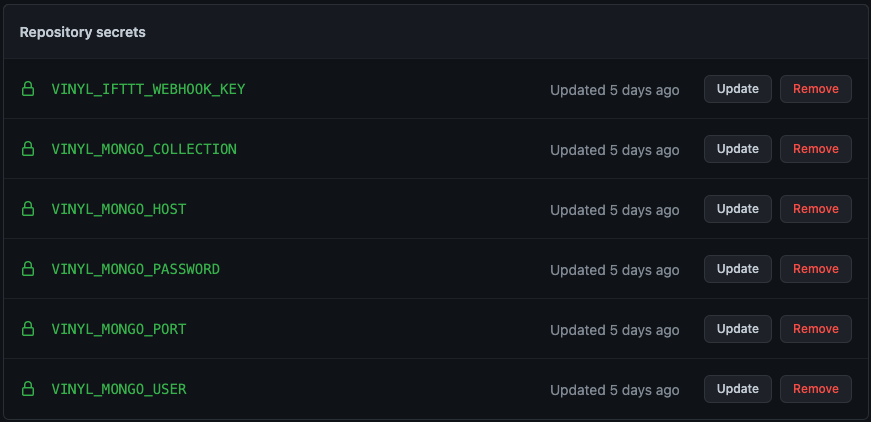
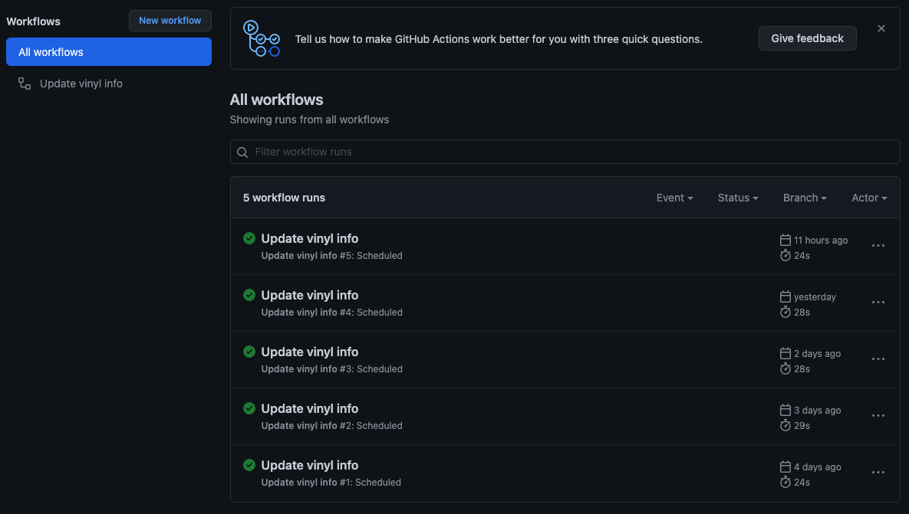
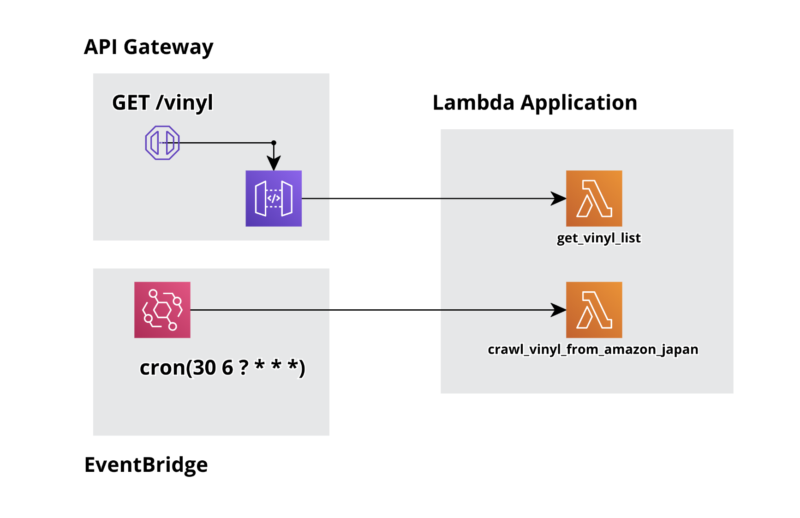

# Amazon Japan Vinyl Alert

A very personal project for getting trends of japanese vinyl market
It includes a function that records newly registered Vinyl information in Amazon Japan based on a specific time every day in the DB and sends it via SMS.

[History: Making post](https://velog.io/@d3fau1t/내가-원하는-데이터를-Python으로-크롤링해서-DB에-넣어보자)

## How to use

### Common

1. Clone the repository
2. Install the dependencies (if you wanna use in local environment)
3. create a `config.dev.json` file in the `serverless` directory
4. Run

```bash
git clone git@github.com:${YOURS}/amazon-japan-vinyl-alert.git
cd amazon-japan-vinyl-alert
pip install -r requirements.txt
vi serverless/config.dev.json
# ... write down your config.dev.json
python run.py
```

#### serverless/config.dev.json

```json
{
  "VINYL_MONGO_HOST":"...",
  "VINYL_MONGO_PORT":"... default: 27017",
  "VINYL_MONGO_USER":"...",
  "VINYL_MONGO_PASSWORD":"...",
  "VINYL_MONGO_COLLECTION":"amazon_japan_lp",
  "VINYL_IFTTT_WEBHOOK_KEY":"...",
  "VINYL_LAMBDA_LAYER":"ARN OF YOUR LAMBDA LAYER"
}
```

### GitHub Action

1. Fork this repository
2. Clone the forked repository
3. Add repository secrets

    

4. Watch your action run

    

## AWS Lambda



1. Clone the repository
2. Install the dependencies
3. Check your AWS Key
4. Add layer on your AWS console and check your `arn` or layer
5. create a `config.dev.json` file in the `serverless` directory
6. Deploy

```bash
npm -i -g serverless
echo "export AWS_ACCESS_KEY_ID=..." >> ~/.bashrc # or ~/.zshrc
echo "export AWS_SECRET_ACCESS_KEY=..." >> ~/.bashrc # or ~/.zshrc
source ~/.bashrc # or ~/.zshrc
git clone https://github.com/dev4hobby/amazon-japan-vinyl-alert.git
cd amazon-japan-vinyl-alert
mkdir python
pip install -r ./requirements.txt -t ./python
zip -r ./python.zip ./python
# Add layer and upload your python.zip
vi serverless/config.dev.json
# ... write down your config.dev.json
sls deploy
```

### Test on local environment

```bash
sls invoke local --function get_vinyl_list
sls invoke local --function crawl_vinyl_from_amazon_japan
```
